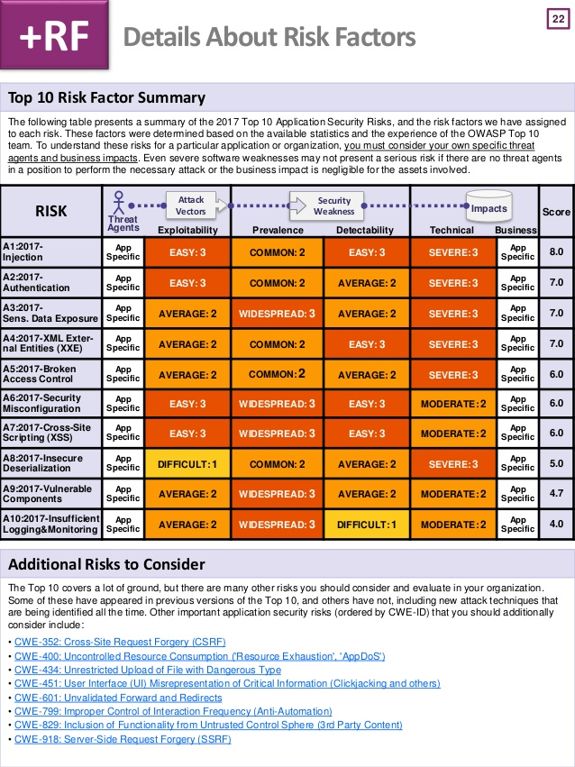
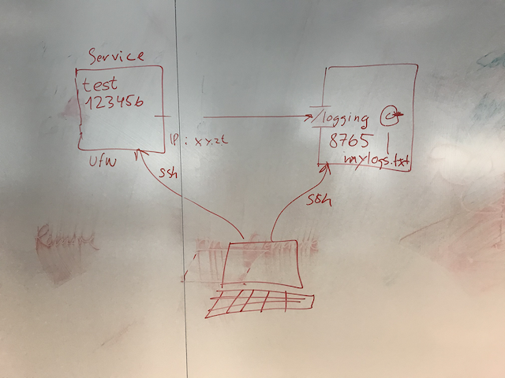

# Week-01 OWASP Rating Methodology

    OWASP - Open Web Application Security Project

## Explain the two sets of Factors - Threat Agents and Vulnerability.

#### Risiko = Sandsynlighed ∗ Påvirkning
##### Trussel
* Erfaring - Hvor teknisk erfarne er gruppen.
* Motiv - Hvor motiveret er gruppen til at finde og udnytte sårbarheden.
* Mulighed - Hvilke muligheder og ressourcer er krævet for gruppen for at finde og udnytte sårbarheden.
* Størrelse - Hvor stor er gruppen.

##### Sårbarhed
* Opdage - Hvor nemt er det for gruppen at opdage sårbarheden.
* Udnytte - Hvor nemt er det for gruppen at udnytte sårbarheden.
* Opmærksomhed - Hvor kendt er sårbarheden for gruppen.
* Afsløring - Hvad er sandsynligheden for at udnyttelsen af sårbarheden bliver opdaget.

<table align="center">
    <tbody>
        <tr>
            <td align="center">0 < 3</td>
            <td align="center">Low</td>
        </tr>
        <tr>
            <td align="center">3 < 6</td>
            <td align="center">Medium</td>
        </tr>
        <tr>
            <td align="center">6 < 10</td>
            <td align="center">High</td>
        </tr>
    </tbody>
</table>

<table align="center">
    <thead>
        <tr>
            <th align="center", colspan="8">Sandsynligheds udregning</th>
        </tr>
    </thead>
    <tbody>
        <tr>
            <td align="center">Erfaring</td>
            <td align="center">Motiv</td>
            <td align="center">Mulighed</td>
            <td align="center">Størrelse</td>
            <td align="center">Opdage</td>
            <td align="center">Udnytte</td>
            <td align="center">Opmærksomhed</td>
            <td align="center">Afsløring</td>
        </tr>
        <tr>
            <td align="center">5</td>
            <td align="center">9</td>
            <td align="center">4</td>
            <td align="center">9</td>
            <td align="center">3</td>
            <td align="center">3</td>
            <td align="center">4</td>
            <td align="center">8</td>
        </tr>
        <tr>
            <td align="center", colspan="4" >Sandsynlighed</td>
            <td align="center">5.625</td>
            <td align="center", colspan="3" >Medium</td>
        </tr>
    </tbody>
</table>

### Give some examples of how you can change those parameters - for example for MySQL servers.
* Injection - Øvelse fra Week1

### Explain how security risks are rated in OWASP.

### Argue whether OWASP gives the complete picture of security risks on an application.
* Top 10

# Week 3 - Logging and monitoring

### Explain the difference between prevention, detection and recovery for systems you develop.
- Prevention
    - Her forbygger du systemet til at modstå de ting der kan ske, ved at sikre de velkendte 10 OWASP ting.
- Detection
    - Her bruger du logs og monitorering til at se om der er sket et brud.
- Recovery
    - Hvis der er sket et brud så fikses det og der lukkes ned for bruddet.

### Discuss how a firewall can produce log files.
Hver gang en forspørgelse bliver lavet til serveren vil den komme forbi firwallen, her bliver den enten godkendt og sendt videre ind eller ikke. Når forspørgelsen rammer kan der laves en log på det, med information såsom IP og tid.

### Explain how to set up a remote logging server, and use that to register logins to an ubuntu server.
Først sættes en HTTP server op med en context path f.eks. /logger, her efter akn vores firewall på den anden server sende et POST request til denne context hvorefter det kan skrives ind i en log fil.

### Explain how to use a cloud-based logging service to enable anomaly detection.
Fleste store cloud-based logging services såsom f.eks. Azure Stream, har veltrænede AI som kan detektere anomaly i real-time. Derfor er det en god ide at bruge disse services, da det vil tage lang tid at træne dem selv.

