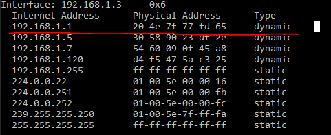

# Week 6 - Network/network protocols and Security
For all questions below, use stored Wireshark samples to support your answer

### Explain conceptually the purpose of the layers in the TCP/IP protocol stack
    (Localhost-Wire-Dump-Image-200)
- TCP (Transmission Control Protocol)
    - Indeholder information omkring Source Port og Destination Port
- IP (Internet Protocol)
    - Inderholder information omkring Source IP og Destination IP
- Ethernet II
    - Indeholder information omrking Source MAC addresse og Destination MAC addresse

### Explain the purpose of the DNS system and the DHCP protocol
    (Localhost-Wire-Dump-MonitoringDNSPackages)
- DNS (Domain Name System)
    - (no. 9) Indeholder Querie med navnet på serveren (play.google.com)
    - (no. 11) Indeholder Querie med svaret og IP addressen på play.google.com

DNS bruges er en navneserver som opbevare IP addresser på servere. For at få en IP tilbage spørger man serveren med en URL. (play.google.com -> 172.217.17.78)

### Explain conceptually the TCP/IP protocols involved in transporting a package (HTTP for example) from Source to Destination.
    (Localhost-Wire-Dump-Image-200)
1. The client sends a HTTP GET request package trough the TCP protocol to the Server.
2. Then the server sends a HTTP 200 OK package back trough the TCP with the resulting data

### Explain, conceptually, about the arp-command and the ARP-protocol
    (CMD Windows -> arp -a) (Rød er Router IP og MAC)

- ARP-protocol er protocolen der fortæller routeren hvilken maskine IP addressen hører til. Det gøres ved hjælp af MAC addressen.
- ARP-command tillader dig at se og ændre på ARP-protocolen

### Explain Conceptually strategies a hacker can use to attack:
- The DNS system
    - En hacker kan lave ARP-Spoofing til at være MITM, så når en bruger spørger DNS severen om en IP vil MITM sende en forkert IP der f.eks. peger til en af hans servere.
- The DHCP protocol
    - En hacker kan lave et MITM attack så han kan bestemme Default Gatewai IP'er for brugere, de kan så f.eks. pege på en af hans servere istedet.
- The TCP-protocol
    - En hacker sender en masse SYN requests til serveren, med en IP der er spoofed. Når serveren så venter på svar på en åben port og der ikke kommer noget bliver hackeren ved med at sende. På den måde vil der tilsidst ikke være flere porte og serveren vil ikke kunne fungere.
- The ARP-protocol
    - En hacker kan ved at injecte ARP protocolen få routeren til at tro at hans MAC addresse er en andens, og derved opsnappe alt traffic der skulle have været til en anden bruger.
